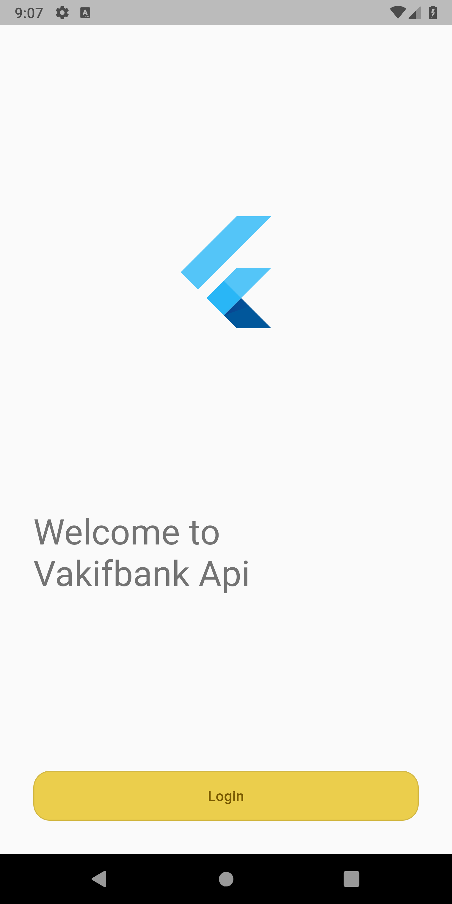
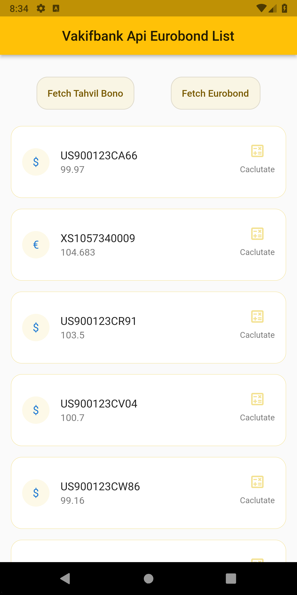
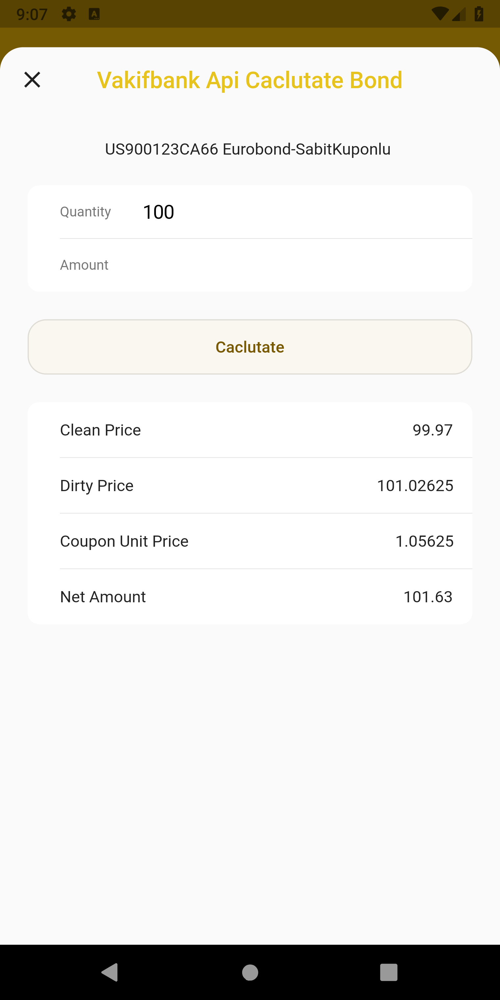

<!-- ABOUT THE PROJECT -->
# Vakifbank Api Example App with Flutter

![version][version_badge]
[![flutter][flutter_badge]][flutter_link]
[![style: very good analysis][vga_badge]][vga_link]
![license: MIT][license_badge]

This project was developed as an example of showing the data received from the bank service (Vakifbank API) to the user in the mobile application.  
API URL: <https://apiportal.vakifbank.com.tr/>

## Screenshots

  

## Summary

* Clean architecture
* Scalable and maintainable code
* bloc for state management
* get_it for service locator
* dio and retrofit for api service
* very_good_analysis for set of lints
* freezed and json_serializable for models

## TODOs

* [x] Minimum viable product
* [ ] more tests
* [ ] add splash screen and logic
* [ ] add navigation service
* [ ] edit theme

<!-- CONTACT -->
## Contact

Ali Dinc - [@acdinc](https://www.linkedin.com/in/acdinc/) - alcmdnc@gmail.com

[version_badge]: https://img.shields.io/badge/version-0.0.1-orange

[flutter_badge]: https://img.shields.io/badge/flutter-3.7.7-blue
[flutter_link]: https://flutter.dev/

[vga_badge]:https://img.shields.io/badge/style-very_good_analysis-B22C89.svg
[vga_link]: https://pub.dev/packages/very_good_analysis

[license_badge]: https://img.shields.io/badge/license-MIT-blue.svg
